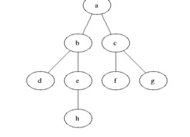

## WAP to implement BFS on the given graph starting at ‘a’

Explanation -> 

This is a C program that implements Breadth First Search (BFS) algorithm on a graph. The program takes input from the user in the form of number of vertices and edges. It then takes input for the vertices that are connected and forms an adjacency matrix.

The program creates a structure named "stack" to implement a queue data structure for BFS traversal. It defines the structure with two integer variables, "front" and "rear" that represent the front and rear of the queue, respectively, and a character array pointer "arr" that holds the data. The program defines various functions for queue manipulation such as "push", "pop", "is_empty" and "display".

In the main function, the program creates an adjacency matrix based on the input edges, and then calls the "bfs" function. The bfs function takes the adjacency matrix and number of vertices as input and prompts the user to enter the source vertex. The function then initializes a queue, marks the source vertex as visited and adds it to the queue using the push function. The function then loops until the queue is empty, and pops the front element from the queue.

The program then marks the current vertex as visited, prints the vertex value, and checks all the adjacent vertices of the current vertex. If any adjacent vertex is not visited, it marks it as visited and adds it to the queue using the push function. The display function is called to print the current state of the queue after every iteration of the loop.

Overall, this program implements the BFS algorithm on a graph and finds the connected components from the given source vertex.
