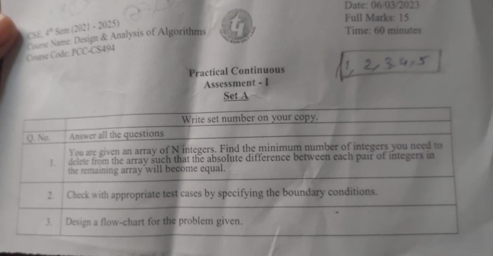

Question ->

In this solution, we first take the input value n which represents the number of integers in the array. We then declare an array a of size n to store the integers.

We then take input the n integers and calculate the absolute difference between adjacent elements. We store these absolute differences in an array diff of size n-1.

We then calculate the greatest common divisor (gcd) of all the absolute differences in the diff array using the built-in function __gcd() from the stdlib.h library. We initialize the gcd variable to the first absolute difference in the diff array.

Finally, we loop through the diff array and count the number of absolute differences that are not equal to gcd. We output this count as the minimum number of integers that need to be deleted from the array such that the absolute difference between each pair of integers in the remaining array will become equal.

The time complexity of this solution is O(n log m), where n is the length of the array and m is the maximum absolute difference between any two adjacent elements in the array. This is because we first loop through the array once to calculate the absolute differences between adjacent elements, which takes O(n) time. We then loop through the absolute differences array twice to calculate the gcd and count the number of differences that are not equal to the gcd, which takes O((n-1) log m) time. The log m factor comes from the __gcd() function, which has a time complexity of O(log m). Overall, the time complexity is dominated by the O((n-1) log m) term.