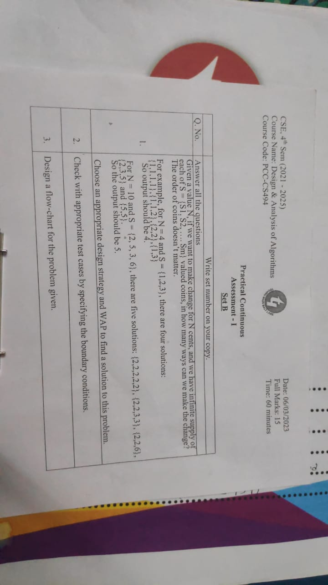

Question ->

This is a C program that calculates the number of ways to make change for a given amount of money using a set of coins. The program uses dynamic programming to solve the problem.

The program starts by defining a function called count that takes three arguments: an array of integers S that contains the values of the coins, an integer m that represents the number of coins, and an integer n that represents the amount of money for which we want to make change.

Inside the count function, the program defines a two-dimensional array called table with n+1 rows and m columns. This array will be used to store the solutions to subproblems.

The program then initializes the first row of the table array to 1, since there is only one way to make change for 0 cents using any set of coins.

The program then proceeds to fill in the rest of the table array using a nested loop. The outer loop iterates over the possible values of n, from 1 to n. The inner loop iterates over the coins in the set, from 0 to m-1.

For each value of n and each coin in the set, the program calculates the number of ways to make change for n using only the coins up to and including the current coin. This value is stored in the x variable.

The program then calculates the number of ways to make change for n using only the coins up to and excluding the current coin. This value is stored in the y variable.

Finally, the program adds x and y and stores the result in the corresponding cell of the table array.

Once the table array has been fully populated, the program returns the value stored in the last cell of the last row, which represents the total number of ways to make change for n using the given set of coins.

The main function of the program prompts the user to enter the value of N and the number and values of the coins. It then calls the count function with the appropriate arguments and displays the result.