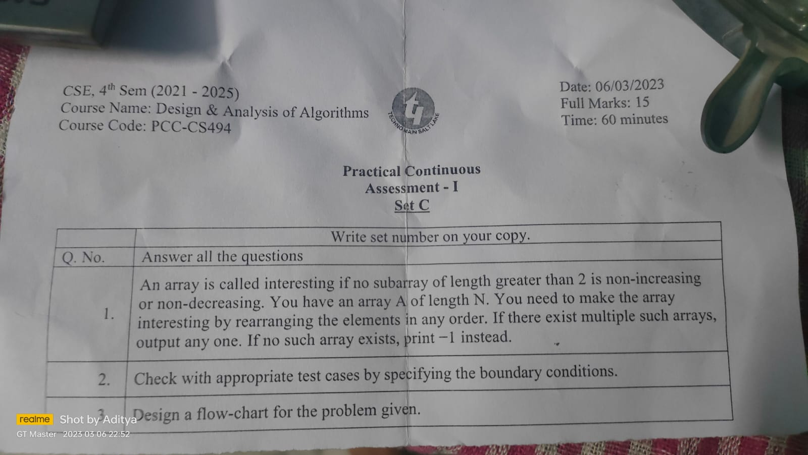

Question ->

This program takes an input array of integers from the user, and tries to rearrange it in any order to make it an interesting array. An interesting array is one where no subarray of length greater than 2 is non-increasing or non-decreasing.

The program first reads the length of the input array n from the user and initializes a count array count to keep track of the number of even and odd elements in the array. It then reads the input array from the user and increments the count of even and odd elements based on their parity.

The program then checks if all elements in the array are even or odd, in which case it prints a message saying that no interesting array exists, and exits the program.

If the input array has both even and odd elements, the program prints the even elements first in their original order, and then prints the odd elements in any order. To do this, it loops through the input array and prints the even elements first. It keeps track of the count of even elements remaining to be printed, and once it has printed all even elements, it loops through the input array again and prints the odd elements in any order.

Finally, the program prints a newline character and returns 0 to indicate successful completion of the program.