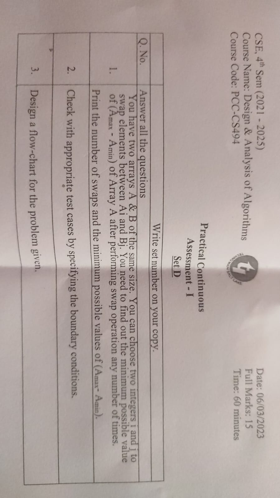

This is a C program that takes user input for the size of two arrays, A and B, and the elements of those arrays. It then finds the minimum possible value of (Amax-Amin) by swapping elements between A and B any number of times. The program outputs the number of swaps and the minimum possible value of (Amax-Amin).

The program first initializes some variables including the minimum and maximum values for A and B, the minimum difference between Amax and Amin, and the number of swaps. It then loops through the elements of A and B to find their minimum and maximum values. It also checks which array has the smaller difference between its maximum and minimum values and sets the minimum difference to that value.

Next, the program loops through every possible pair of elements in A and B and calculates the difference between their maximum and minimum values. If the difference between A's maximum and minimum values is greater than the difference between B's maximum and minimum values, and the element in A is less than the element in B, and the difference between the two elements is less than the difference between A's maximum and minimum values minus B's maximum and minimum values, then the elements are swapped. The same is done if the difference between B's maximum and minimum values is greater than the difference between A's maximum and minimum values.

After swapping, the program again calculates the minimum and maximum values for A and B and the minimum difference between Amax and Amin. The program then increments the number of swaps.

The program continues to loop through every possible pair of elements in A and B until no more swaps can be made. Finally, the program outputs the number of swaps and the minimum possible value of (Amax-Amin).

The time complexity of this program is O(n^3) because it has two nested loops that iterate over the arrays and another loop that iterates over the arrays again. This makes the program inefficient for large input sizes. A more efficient solution would involve sorting the arrays and swapping the appropriate elements to minimize the difference between Amax and Amin. This would have a time complexity of O(nlogn).