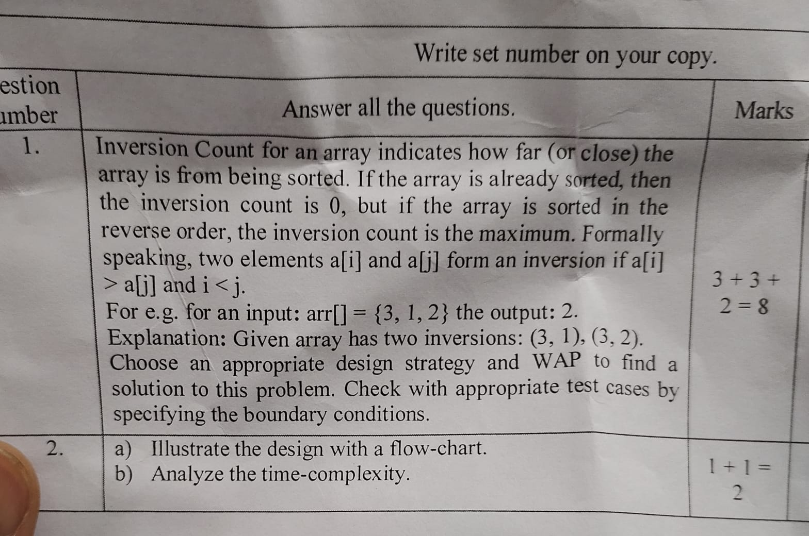

Question ->

This code implements the Inversion Count algorithm using the Merge Sort approach in C language. The program starts by defining two functions: merge() and mergeSort().

The merge() function takes four arguments, the array to be sorted, a temporary array, the leftmost index of the array, the middle index, and the rightmost index of the array. This function is responsible for merging two subarrays of the input array and counting the number of inversions between the two subarrays. It does so by comparing each element in the two subarrays and incrementing the inv_count variable if an inversion is found.

The mergeSort() function is a recursive function that takes four arguments, the array to be sorted, a temporary array, the leftmost index of the array, and the rightmost index of the array. This function recursively divides the array into two halves and calls itself to sort each half. The merge() function is then called to merge the two sorted halves while counting the inversions between them.

In the main function, the program prompts the user to enter the size of the array and the elements of the array. The mergeSort() function is called with the input array and its length to find the number of inversions in the array. The output is then displayed on the console, which is the number of inversions in the given array.

Overall, the program uses the Merge Sort approach to count the number of inversions in an array, which provides an efficient solution to the problem.