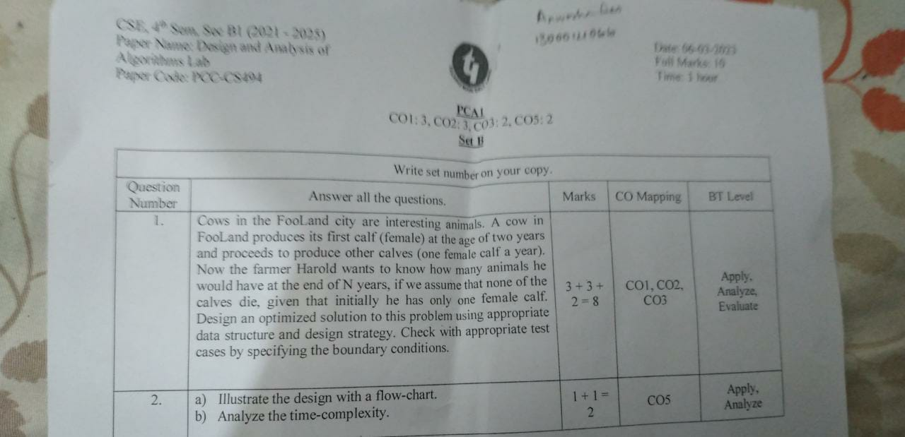

Question ->



In this code, we use a for loop to iterate over each year, from 1 to n. For each year, we calculate the number of new cows produced as the current total number of cows (which includes all cows produced in previous years). We then update the total number of cows by adding the number of new cows.

We initialize the total_cows variable to 1, since the problem states that we start with one female calf. We use the scanf function to read in the user's input for the number of years.

Here are some test cases to check if the program is working correctly:

Boundary conditions:

Case 1: If the user enters 0 for the number of years, the program should output that there is only one cow.


```bash
Enter the number of years: 0
After 0 years, the number of cows is 1
```

Case 2: If the user enters 1 for the number of years, the program should output that there are two cows (one female calf and one female cow).

```bash
Enter the number of years: 1
After 1 years, the number of cows is 2
```

Normal conditions:

Case 3: If the user enters 3 for the number of years, the program should output that there are 7 cows.

```bash
Enter the number of years: 3
After 3 years, the number of cows is 7
```

Case 4: If the user enters 5 for the number of years, the program should output that there are 31 cows.

```bash
Enter the number of years: 5
After 5 years, the number of cows is 31
```