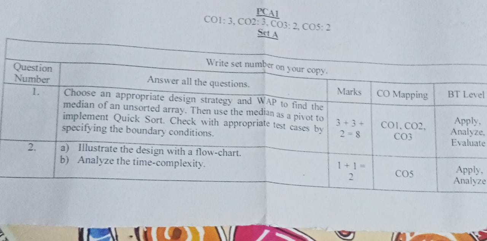

Question -> 

This is a C program to find the median of an unsorted array and then apply quick sort on that array using the median as the pivot.

The program starts by including the necessary header files and declaring the required functions. The swap function is used to swap two elements in an array. The partition function is used to partition the array around the pivot element (median in this case). The find_median function is used to find the median of the unsorted array. Finally, the quick_sort function is used to implement quick sort using the median as the pivot.

In the main function, the user is prompted to enter the size of the array and the elements of the array. The find_median function is called to find the median of the array, and this value is printed to the console. Then, the quick_sort function is called to sort the array using the median as the pivot. The sorted array is printed to the console.

The program uses selection sort to find the median of the unsorted array. The find_median function starts by iterating over each element of the array and finding the smallest element. This element is then swapped with the first element of the array. This process is repeated for each subsequent element of the array until the entire array is sorted. The median element is then returned, which is the element at the middle index of the sorted array.

The quick_sort function uses the median as the pivot element for partitioning the array. It first calls the find_median function to find the median of the subarray. Then, it calls the partition function to partition the subarray around the pivot element. It then recursively calls itself on the left and right subarrays to sort the entire array.

Overall, this program demonstrates how to use the median as the pivot element in quick sort to improve the worst-case performance of the algorithm.